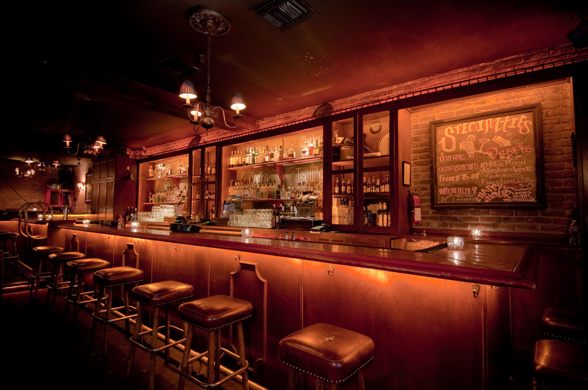

# Bar managment service

ASP service to help you organise your bar!

## How to launch:
- Clone this repository
- Create database
- Define your connection string 
(Search > SQL Server Object Explorer > Open your database > Right Click: properties > Copy your connection striung and paste it as Deafult in appsettings.json)
- add-migration InitialCreate in Console package manager
- update-database in Console package manager
- Launch and enjoy the project

## Users credentials:
- Admin:
Login: michal.jakobczyk2@gmail.com
Password: Bar123!
- User:
Login: user@gmail.com
Password: User123!
